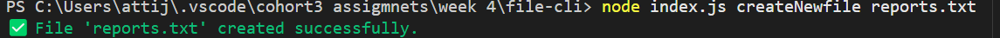
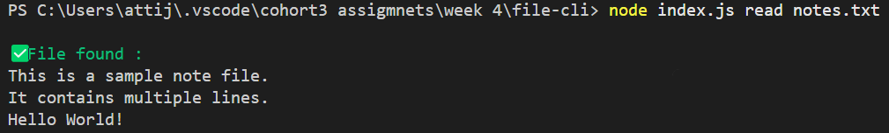
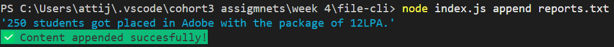
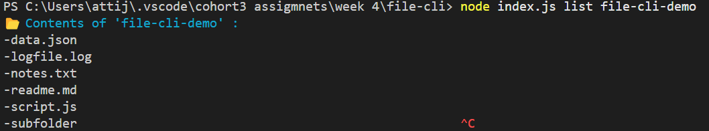
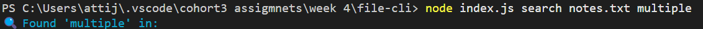
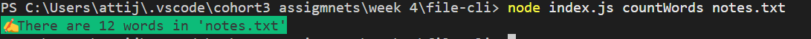

# 📁 File System CLI Tool

A Node.js-based command-line interface (CLI) that allows users to perform common file system operations like creating, reading, appending, deleting, renaming files/folders, and more.

---

## 🚀 Features

### 📄 File Commands

- `createNF <filename>`: Create a new file
- `read <filename>`: Read and display file contents
- `append <filename> <content>`: Append content to an existing file
- `delete <filename>`: Delete a file
- `rename <oldname> <newname>`: Rename a file

### 📁 Folder Commands

- `makdir <foldername>`: Create a new folder
- `remdir <foldername>`: Remove a folder (recursively)

### 📦 File/Folder Movement

- `move <source> <destination>`: Move a file or folder

### 📚 Analysis & Info

- `list [directory]`: List files and folders in a directory
- `search <file> <word>`: Search for a word in a file (shows line numbers)
- `countWords <file>`: Count number of words in a file
- `countLines <file>`: Count number of lines in a file

---

## 📸 CLI Screenshots

### ✅ Creating a File


### 📖 Reading a File


### ➕ Appending Content


### 📂 Listing Files


### 🔍 Searching for a Word


### ✍️ Word & Line Count



---

## 🧑‍💻 Getting Started

### 1. Clone the Repo

```bash
git clone https://github.com/your-username/file-cli.git
cd file-cli
```

### 2. Install Dependencies

```bash
npm install
```

### 3. Run CLI Commands

```bash
node index.js list
node index.js read notes.txt
node index.js append notes.txt "New line"
```

---

## 📦 Dependencies

- [commander](https://www.npmjs.com/package/commander)
- [chalk](https://www.npmjs.com/package/chalk)
- `fs` (Node.js built-in)
- `path` (Node.js built-in)

---

## 📁 Example Folder

You can use the included `file-cli-demo` folder to test all the features.

---

## 📝 Author

Jayavardhan Atti

> ⚡ Tip: You can make it globally executable with `npm link` for ease of use.
